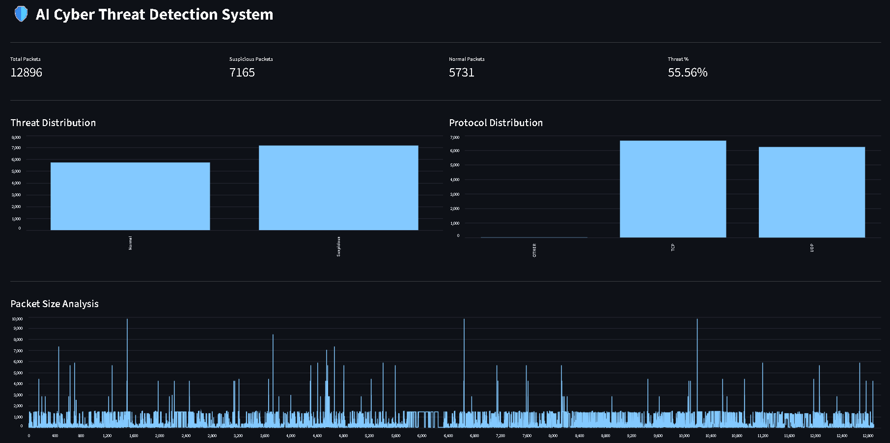

# 🛡️ AI Cyber Threat Detection System

## 📌 Overview
This project is an **AI-powered cyber threat detection system** that analyzes network activity and log data to identify and classify potential security threats in real time. It helps in detecting anomalies, malicious behavior, and suspicious patterns using machine learning techniques.

---

## 🚀 Features
- 🔍 Real-time threat detection from log/network data  
- 🤖 Machine Learning–based classification of attacks  
- 📊 Interactive dashboard for monitoring results  
- 📁 CSV-based logging for detected events  
- ⚡ Fast and lightweight local deployment  
- 📈 Visualization of threat trends and patterns  

---

## 🏗️ Project Structure

ai-cyber-threat-detection-system/

├── live_detection.py        # Real-time detection script  
├── dashboard.py             # Visualization dashboard  
├── dataset.csv              # Processed logs / training data  
├── requirements.txt         # Dependencies  
└── README.md                # Project documentation  

---

## ⚙️ Tech Stack
- Python  
- Pandas / NumPy – Data processing  
- Scikit-learn – Machine learning models  
- Matplotlib / Plotly – Data visualization  
- Streamlit / Flask (if used) – Dashboard UI  
- CSV – Data storage layer  

---

## 🧠 How It Works
1. Network/log data is collected and stored in a structured format  
2. Data is preprocessed and cleaned  
3. Machine learning model analyzes patterns and detects anomalies  
4. System classifies activity as normal or malicious  
5. Results are logged into CSV and displayed on the dashboard  

---

## 📊 Dashboard Preview



- Detected threats count  
- Live logs  
- Attack type distribution  
- Time-based activity trends  


---

## 🛠️ Installation & Setup

```bash
# Clone the repository
git clone https://github.com/shuklautkarsh2204/ai-cyber-threat-detection-system.git

# Navigate into project folder
cd ai-cyber-threat-detection-system

# Install dependencies
pip install -r requirements.txt

```
---

## ▶️Run the Program

Step 1. Start Live Detection

```bash
python live_detection.py
```
Step 2. Launch the Dashboard

```bash
streamlit dashboard.py
```
---
## 📌 Future Improvements

- Add authentication system for dashboard
- Deploy on cloud (AWS / Azure / Render)
- Integrate real network packet capture
- Improve ML model accuracy with deep learning
- Add advanced analytics and alert system

## 📜License

This project is licensed under the MIT License.
You are free to use, modify, and distribute this project with proper attribution.

See the LICENSE file for more details.


## 👨‍💻 Author

Developed by **Utkarsh Shukla**  
AI/ML Enthusiast | Cybersecurity Learner | Python Developer

Focused on building practical machine learning and cybersecurity solutions with real-world applications.
